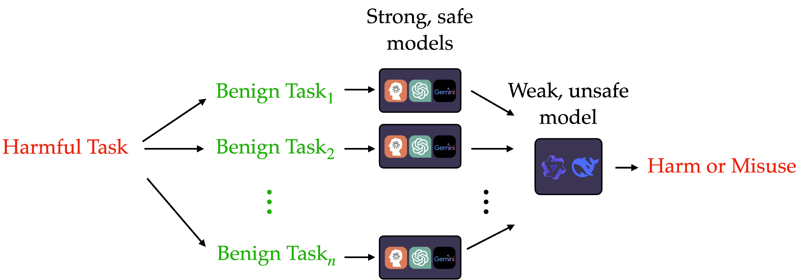

# Benchmarking Misuse Mitigation Against Covert Adversaries

Code for the attacks and defenses in our paper, [Benchmarking Misuse Mitigation Against Covert Adversaries](https://www.arxiv.org/abs/2506.06414).

## Overview

This repository contains implementations of various defense mechanisms against covert adversarial attacks on language models. The defenses are designed to detect and mitigate harmful requests that are *potentially distributed across multiple users or user sessions*. Please [see our paper](https://www.arxiv.org/abs/2506.06414) for details.

## Dataset

The defenses in this repository are designed to work with the **Benchmarks for Stateful Defenses (BSD)** dataset, which contains challenging questions that test "misuse uplift" and "detectability" of harmful request patterns.

### Accessing the BSD Dataset

The BSD dataset is available through HuggingFace at: **https://huggingface.co/datasets/BrachioLab/BSD**

**Access Policy**: The dataset has restricted access to enable legitimate safety research while preventing potential harmful applications. To access the dataset:

1. Visit our HuggingFace dataset page
2. Submit a request through the provided form. We will follow-up with an email asking about your usecase.

## Attacks

All attack implementations are available in the `JB_attacks/` folder. See the [JB_attacks README](JB_attacks/README.md) for usage instructions.

- **Decomposition Attacks** - The primary focus of our work is on decomposition attacks, where harmful requests are broken into seemingly benign sub-questions distributed across multiple interactions or users. This covert approach makes detection significantly more challenging for traditional safety mechanisms.

- **Comparison Methods** - To evaluate defense effectiveness, we compare against several established jailbreaking methods:
    - PAIR
    - Adaptive Attack
    - Adversarial Reasoning
    - Crescendo

## Defenses

The `defense/` folder is organized into two main categories: `prompt_wise/` contains defenses that operate on individual queries without maintaining state, while `stateful/` contains defenses that track information across multiple queries to detect covert attacks. 

### Prompt-wise Defenses (`prompt_wise/`)

- **`modeling/`** -  Inference, adversarial training, and evaluating the defenses on the decomposition dataset. 
  - `training/` - Adversarial finetuning against PAIR/decomposition attacks
    - [`finetune_8b_binary.py`](defense/prompt_wise/modeling/training/finetune_8b_binary.py) - Adversarial training for decomposition attacks
    - [`finetune_pair.py`](defense/prompt_wise/modeling/training/finetune_pair.py) - Adversarial training against PAIR jailbreaks
  - `inference/` - Prediction and inference utilities
    - [`predict.py`](defense/prompt_wise/modeling/inference/predict.py) - Basic prediction utilities
    - [`predict_pair.py`](defense/prompt_wise/modeling/inference/predict_pair.py) - Evaluating detection defenses on PAIR attacks
    - [`pointwise_defense.py`](defense/prompt_wise/modeling/inference/pointwise_defense.py) - Evaluating pointwise detection defenses for decomposition

### Stateful Defenses (`stateful/`)

- **`buffer_methods/`** - Buffer-based stateful defense mechanisms
  - [`buffer_decomp.py`](defense/stateful/buffer_methods/buffer_decomp.py) and [`buffer_defense.py`](defense/stateful/buffer_methods/buffer_defense.py) - Buffer defenses
  - [`buffer_defense_together.py`](defense/stateful/buffer_methods/buffer_defense_together.py) - Buffer defense strategy using Llama 70B with the Together API
  - [`random_sample.py`](defense/stateful/buffer_methods/random_sample.py) - Stateful evaluation through sampling across multiple runs
